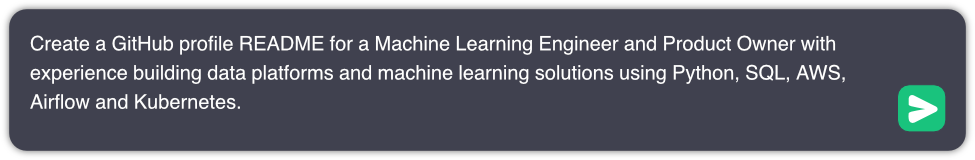

# Hi there! 👋 I'm Ben

  

## About Me

I'm a passionate Machine Learning Engineer and Product Owner with a knack for building robust data platforms and cutting-edge machine learning solutions. I thrive on creating value by bridging the gap between technical innovation and real-world business needs.

🔭 Currently, I'm working on building data platforms and architecting ML solutions to drive program performance at Lockheed Martin.

🌱 I'm constantly learning and keeping up with the latest trends in AI/ML, cloud native technologies, and DevOps practices.

💡 I believe in the power of collaboration and open-source. Let's connect and create something amazing together!

## Tech

## Stats

  
  

## Let's Connect!

I'm always excited to connect with fellow tech enthusiasts, business minds, and open-source collaborators. Feel free to reach out to me.

Looking forward to exploring new opportunities and creating impactful solutions together!